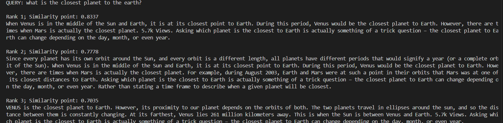

# [PROJECT] Text Retrieval Basically 

## Introduction

Have you ever wondered how Google's search engines can return related pages even when you don't type the exact content correctly? Here is my basic solution about this topic. With datasets of MS_MARCO.

## Setup
> pip install datasets 

## Datasets
https://microsoft.github.io/msmarco/

## Notices

* Because the datasets of msmarco are very big, so i only use datasets for test and 'entity' type to reduce memory usage.
* This project is very basic. We can use more techniques to improve the performance such as replace bag-of-words is used in my code by TF-IDF, word2vec or BERT.
## Examples
 

## Requirements
* **Python**
* **Basic knowledge of nlp**
* **Cosine similarity**
